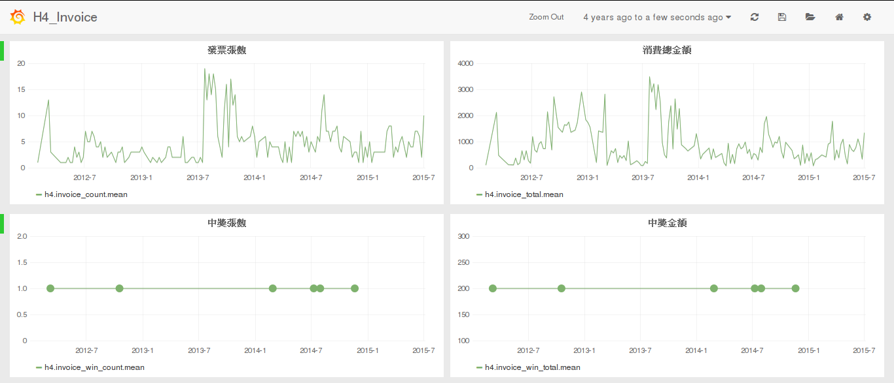

# H4基金

**基金、聚會活動更新、及例行事項，目前主要由聚會的值日生們維護。**
**現任值日生列表，請參考: [routine](routine) 頁面內容。**

Should you want to donate and contribute, feel free to donate @ 31 00054 046 (808 玉山銀行) - [NTD] or @ 0x4e0b5e15f72ffcf464562d672102d1b685c681f8 [ETH]. Please mention your donation information -date:time:amount- to me @flaing12 on telegram, on LINE, or on facebook. Thank you.

## 發票募集

### H4 發票募集活動


活動辦法:

```
聚會當天點餐後，意者將發票交給任一值日生即可。( 發票可註名 id, 或可不填 )
```

### 為什麼要募集發票

- 消費狀況紀錄
  - 做為與場地店家商談的依據
  - 作為聚會地點選擇的價位參考
- 幫您對獎。中獎者可以：
  - 將金額領回
  - 捐出來做聚會基金

### h4ckers 的權益


我們會於每個對獎日後通知有得獎的人，並公佈至該月基金運用狀況。

h4ckers 可以提出建議，運用基金來購買書籍、開發板等。

## 發票統計

2018年09月: 共  張，合計  元。
|            |       |      |
| ---------- | ----- | ---- |
| 2018-09-06 | $1986 | 2 張 |

2018年08月: 共  張，合計  元。
|            |       |      |
| ---------- | ----- | ---- |
| 2018-08-16 | $1197 | 1 張 |
| 2018-08-09 | $2283 | 2 張 |
| 2018-08-02 | $1338 | 2 張 |

2018年07月: 共  張，合計  元。
|            |       |      |
| ---------- | ----- | ---- |
| 2018-07-26 | $1761 | 2 張 |
| 2018-07-19 | $2393 | 2 張 |
| 2018-07-12 | $1357 | 1 張 |
| 2018-07-05 | $2057 | 2 張 |

2018年06月: 共  張，合計  元。
|            |       |      |
| ---------- | ----- | ---- |
| 2018-06-28 | $3033 | 3 張 |
| 2018-06-21 | $1480 | 1 張 |
| 2018-06-14 | $1317 | 1 張 |
| 2018-06-07 | $1495 | 1 張 |

2018年05月: 共  張，合計  元。
|            |       |      |
| ---------- | ----- | ---- |
| 2018-05-31 | $1945 | 1 張 |
| 2018-05-24 | $1302 | 2 張 |
| 2018-05-17 | $938  | 1 張 |
| 2018-05-10 | $1291 | 2 張 |
| 2018-05-03 | $957  | 1 張 |

2018年04月: 共  張，合計  元。
|            |       |      |
| ---------- | ----- | ---- |
| 2018-04-26 | $1431 | 1 張 |
| 2018-04-19 | $2349 | 2 張 |
| 2018-04-12 | $1760 | 2 張 |

2018年03月: 共  張，合計  元。
|            |       |      |
| ---------- | ----- | ---- |
| 2018-03-29 | $1795 | 1 張 |
| 2018-03-22 | $1465 | 1 張 |
| 2018-03-15 | $1027 | 1 張 |
| 2018-03-08 | $1425 | 1 張 |
| 2018-03-01 | $2239 | 2 張 |

2018年02月: 共  張，合計  元。
|            |       |      |
| ---------- | ----- | ---- |
| 2018-02-22 | $2322 | 2 張 |
| 2018-02-08 | $1395 | 2 張 |
| 2018-02-01 | $2648 | 2 張 |

2018年01月: 共  張，合計  元。
|            |       |      |
| ---------- | ----- | ---- |
| 2018-01-25 | $1857 | 2 張 |
| 2018-01-18 | $3072 | 3 張 |
| 2018-01-11 | $1965 | 2 張 |
| 2018-01-04 | $1147 | 1 張 |

2017年12月: 共  張，合計  元。
|            |      |      |
| ---------- | ---- | ---- |
| 2017-12-07 | $957 | 1 張 |

2017年11月: 共  張，合計  元。
|            |       |      |
| ---------- | ----- | ---- |
| 2017-11-30 | $1616 | 2 張 |
| 2017-11-23 | $764  | 1 張 |
| 2017-11-16 | $1978 | 1 張 |
| 2017-11-09 | $1430 | 1 張 |
| 2017-11-02 | $1581 | 2 張 |

2017年10月: 共  張，合計  元。
|            |      |      |
| ---------- | ---- | ---- |
| 2017-10-12 | $914 | 1 張 |
| 2017-10-05 | $704 | 1 張 |

2017年9月: 共  張，合計  元。
|            |       |      |
| ---------- | ----- | ---- |
| 2017-09-28 | $944  | 1 張 |
| 2017-09-21 | $2463 | 2 張 |
| 2017-09-15 | $2024 | 2 張 |
| 2017-09-07 | $1143 | 2 張 |

2017年8月: 共 5 張，合計 5332 元。
|            |       |      |
| ---------- | ----- | ---- |
| 2017-08-24 | $978  | 1 張 |
| 2017-08-17 | $1182 | 1 張 |
| 2017-08-10 | $2114 | 2 張 |
| 2017-08-03 | $1058 | 1 張 |

2017年7月: 共 6 張，合計 4609 元。
|            |       |      |
| ---------- | ----- | ---- |
| 2017-07-20 | $2100 | 2 張 |
| 2017-07-13 | $1464 | 2 張 |
| 2017-07-06 | $1045 | 2 張 |

2017年6月: 共 9 張，合計 7909 元。
|            |       |      |
| ---------- | ----- | ---- |
| 2017-06-29 | $2516 | 3 張 |
| 2017-06-22 | $1633 | 2 張 |
| 2017-06-08 | $2369 | 2 張 |
| 2017-06-01 | $1391 | 1 張 |

2017年5月: 共 3 張，合計 2272 元。
|            |       |      |
| ---------- | ----- | ---- |
| 2017-05-18 | $749  | 1 張 |
| 2017-05-11 | $1523 | 2 張 |

2017年4月: 共 8 張，合計 5588 元。
|            |       |      |
| ---------- | ----- | ---- |
| 2017-04-27 | $1323 | 2 張 |
| 2017-04-20 | $1648 | 2 張 |
| 2017-04-13 | $1100 | 2 張 |
| 2017-04-06 | $1517 | 2 張 |

2017年3月: 共 7 張，合計 6862 元。
|            |       |      |
| ---------- | ----- | ---- |
| 2017-03-30 | $1737 | 2 張 |
| 2017-03-23 | $2251 | 2 張 |
| 2017-03-16 | $1472 | 2 張 |
| 2017-03-09 | $1402 | 1 張 |

2017年2月: 共 4 張，合計 4810 元。
|            |       |      |
| ---------- | ----- | ---- |
| 2017-02-16 | $2039 | 2 張 |
| 2017-02-09 | $2771 | 2 張 |

2017年1月: 共 4 張，合計 4295 元。
|            |       |      |
| ---------- | ----- | ---- |
| 2017-01-19 | $1760 | 2 張 |
| 2017-01-12 | $1462 | 1 張 |
| 2017-01-05 | $1073 | 1 張 |

2016年12月: 共 9 張，合計 9514 元。( 中 1 張，2016-12-08)
|            |       |      |
| ---------- | ----- | ---- |
| 2016-12-29 | $2682 | 2 張 |
| 2016-12-22 | $1531 | 2 張 |
| 2016-12-15 | $1744 | 1 張 |
| 2016-12-08 | $2210 | 2 張 |
| 2016-12-01 | $1347 | 2 張 |
[[image IMAG2232.jpg size="small"]]

2016年11月: 共 10 張，合計 6209 元。
|            |       |      |
| ---------- | ----- | ---- |
| 2016-11-24 | $1862 | 4 張 |
| 2016-11-17 | $1132 | 2 張 |
| 2016-11-10 | $1328 | 2 張 |
| 2016-11-03 | $1887 | 2 張 |

2016年10月: 共 9 張，合計 6605 元。
|            |       |      |
| ---------- | ----- | ---- |
| 2016-10-27 | $1832 | 2 張 |
| 2016-10-20 | $1618 | 2 張 |
| 2016-10-13 | $906  | 2 張 |
| 2016-10-06 | $2249 | 3 張 |

2016年09月: 共 11 張，合計 9664 元。
|            |       |      |
| ---------- | ----- | ---- |
| 2016-09-29 | $1185 | 2 張 |
| 2016-09-22 | $2541 | 3 張 |
| 2016-09-09 | $3792 | 4 張 |
| 2016-09-01 | $2146 | 2 張 |

2016年8月: 共 9 張，合計 7852 元。
|            |       |      |
| ---------- | ----- | ---- |
| 2016-08-25 | $1358 | 2 張 |
| 2016-08-18 | $4405 | 4 張 |
| 2016-08-11 | $633  | 1 張 |
| 2016-08-04 | $1456 | 2 張 |

2016年7月: 共 5 張，合計 3305 元。
|            |       |      |
| ---------- | ----- | ---- |
| 2016-07-21 | $2047 | 3 張 |
| 2016-07-14 | $1258 | 2 張 |

2016年6月: 共 8 張，合計 6538 元。
|            |       |      |
| ---------- | ----- | ---- |
| 2016-06-30 | $2055 | 3 張 |
| 2016-06-16 | $868  | 1 張 |
| 2016-06-09 | $1146 | 1 張 |
| 2016-06-02 | $2469 | 3 張 |

2016年5月: 共 12 張，合計 9072 元。
|            |       |      |
| ---------- | ----- | ---- |
| 2016-05-26 | $1805 | 2 張 |
| 2016-05-19 | $1030 | 2 張 |
| 2016-05-12 | $2041 | 3 張 |
| 2016-05-05 | $4196 | 5 張 |

2016年5月: 共 10 張，合計 7267 元。
|            |       |      |
| ---------- | ----- | ---- |
| 2016-05-19 | $1030 | 2 張 |
| 2016-05-12 | $2041 | 3 張 |
| 2016-05-05 | $4196 | 5 張 |

2016年4月: 共 9 張，合計 6318 元。
|            |       |      |
| ---------- | ----- | ---- |
| 2016-04-21 | $3193 | 5 張 |
| 2016-04-14 | $2298 | 3 張 |
| 2016-04-07 | $827  | 1 張 |

2016年3月: 共 12 張，合計 5518 元。
|            |       |      |
| ---------- | ----- | ---- |
| 2016-03-31 | $1341 | 2 張 |
| 2016-03-24 | $1487 | 2 張 |
| 2016-03-17 | $2010 | 4 張 |
| 2016-03-10 | $450  | 3 張 |
| 2016-03-03 | $230  | 1 張 |

2016年2月: 共 2 張，合計 470 元。
|            |      |      |
| ---------- | ---- | ---- |
| 2016-02-04 | $470 | 2 張 |

2016年1月: 共 33 張，合計 5905 元。
|            |       |       |
| ---------- | ----- | ----- |
| 2016-01-28 | $3375 | 20 張 |
| 2016-01-21 | $945  | 4 張  |
| 2016-01-14 | $745  | 4 張  |
| 2016-01-07 | $840  | 5 張  |

2015年12月: 共 20 張，合計 3533 元。( 中1張，2015-12-24 )
|            |      |      |
| ---------- | ---- | ---- |
| 2015-12-31 | $990 | 6 張 |
| 2015-12-24 | $788 | 5 張 |
| 2015-12-17 | $615 | 3 張 |
| 2015-12-10 | $635 | 3 張 |
| 2015-12-03 | $505 | 3 張 |
註: 感謝 yjchen 另捐給 H4 11-12 月發票共三張


2015年11月: 共 41 張，合計 6495 元。
|            |       |       |
| ---------- | ----- | ----- |
| 2015-11-26 | $1075 | 7 張  |
| 2015-11-19 | $820  | 7 張  |
| 2015-11-12 | $1285 | 10 張 |
| 2015-11-05 | $3315 | 17 張 |
註: 感謝 yjchen 另捐給 H4 11-12 月發票共一張

2015年10月: 共 50 張，合計 7840 元。
|            |       |       |
| ---------- | ----- | ----- |
| 2015-10-29 | $1870 | 13 張 |
| 2015-10-22 | $2035 | 12 張 |
| 2015-10-15 | $2150 | 11 張 |
| 2015-10-08 | $645  | 6 張  |
| 2015-10-01 | $1140 | 8 張  |

2015年09月: 共 45 張，合計 6815 元。
|            |       |       |
| ---------- | ----- | ----- |
| 2015-09-24 | $750  | 5 張  |
| 2015-09-17 | $3620 | 21 張 |
| 2015-09-10 | $1525 | 12 張 |
| 2015-09-03 | $920  | 7 張  |

2015年08月: 共 26 張，合計 4345 元。
|            |       |      |
| ---------- | ----- | ---- |
| 2015-08-27 | $1130 | 8 張 |
| 2015-08-20 | $1270 | 7 張 |
| 2015-08-13 | $945  | 5 張 |
| 2015-08-06 | $1000 | 6 張 |

2015年07月: 共 30 張，合計 4915 元。
|            |       |       |
| ---------- | ----- | ----- |
| 2015-07-30 | $1550 | 8 張  |
| 2015-07-23 | $825  | 5 張  |
| 2015-07-16 | $770  | 4 張  |
| 2015-07-09 | $430  | 3 張  |
| 2015-07-02 | $1340 | 10 張 |

2015年06月: 共 22 張，合計 3050 元。
|            |       |      |
| ---------- | ----- | ---- |
| 2015-06-25 | $330  | 2 張 |
| 2015-06-18 | $845  | 6 張 |
| 2015-06-11 | $1105 | 7 張 |
| 2015-06-04 | $770  | 7 張 |

2015年05月: 共 15 張，合計 2365 元。
|            |      |      |
| ---------- | ---- | ---- |
| 2015-05-28 | $625 | 4 張 |
| 2015-05-21 | $700 | 4 張 |
| 2015-05-14 | $890 | 5 張 |
| 2015-05-07 | $150 | 2 張 |

2015年04月: 共 22 張，合計 3552 元。
|            |       |      |
| ---------- | ----- | ---- |
| 2015-04-30 | $485  | 4 張 |
| 2015-04-23 | $1095 | 6 張 |
| 2015-04-16 | $910  | 5 張 |
| 2015-04-09 | $378  | 3 張 |
| 2015-04-02 | $684  | 4 張 |

2015年03月: 共 25 張，合計 3947 元。
|            |       |      |
| ---------- | ----- | ---- |
| 2015-03-26 | $298  | 2 張 |
| 2015-03-19 | $1785 | 8 張 |
| 2015-03-12 | $958  | 8 張 |
| 2015-03-05 | $906  | 7 張 |

2015年02月: 共 6 張，合計 906 元。
|            |      |      |
| ---------- | ---- | ---- |
| 2015-02-26 | $413 | 3 張 |
| 2015-02-12 | $493 | 3 張 |

2015年01月: 共 14 張，合計 1572 元。
|            |      |      |
| ---------- | ---- | ---- |
| 2015-01-29 | $350 | 3 張 |
| 2015-01-22 | $313 | 3 張 |
| 2015-01-15 | $75  | 1 張 |
| 2015-01-08 | $576 | 5 張 |
| 2015-01-01 | $258 | 2 張 |

2014年12月: 共 13 張，合計 1684 元。
|            |      |      |
| ---------- | ---- | ---- |
| 2014-12-25 | $548 | 4 張 |
| 2014-12-18 | $168 | 1 張 |
| 2014-12-11 | $873 | 7 張 |
| 2014-12-04 | $95  | 1 張 |

2014年11月: 共 13 張，合計 1920 元。( 中1張，2014-11-20 )
|            |      |      |
| ---------- | ---- | ---- |
| 2014-11-27 | $498 | 3 張 |
| 2014-11-20 | $408 | 3 張 |
| 2014-11-13 | $348 | 2 張 |
| 2014-11-06 | $666 | 5 張 |

2014年10月: 共 18 張，合計 2727 元。
|            |      |      |
| ---------- | ---- | ---- |
| 2014-10-23 | $741 | 5 張 |
| 2014-10-16 | $979 | 6 張 |
| 2014-10-09 | $368 | 3 張 |
| 2014-10-02 | $639 | 4 張 |

2014年09月: 共 27 張，合計 3919 元。
|            |       |      |
| ---------- | ----- | ---- |
| 2014-09-25 | $1202 | 8 張 |
| 2014-09-18 | $947  | 7 張 |
| 2014-09-11 | $989  | 7 張 |
| 2014-09-04 | $781  | 5 張 |

2014年08月: 共 39 張，合計 6004 元。
|            |       |       |
| ---------- | ----- | ----- |
| 2014-08-28 | $1062 | 7 張  |
| 2014-08-21 | $1280 | 7 張  |
| 2014-08-14 | $1962 | 14 張 |
| 2014-08-07 | $1700 | 11 張 |

2014年07月: 共 23 張，合計 2701 元。( 中2張，2014-07-10，2014-07-31 )
|            |      |      |
| ---------- | ---- | ---- |
| 2014-07-31 | $583 | 5 張 |
| 2014-07-24 | $783 | 6 張 |
| 2014-07-17 | $295 | 3 張 |
| 2014-07-10 | $495 | 4 張 |
| 2014-07-03 | $545 | 5 張 |


2014年06月: 共 20 張，合計 2573 元。
|            |      |      |
| ---------- | ---- | ---- |
| 2014-06-26 | $328 | 3 張 |
| 2014-06-19 | $708 | 6 張 |
| 2014-06-12 | $549 | 4 張 |
| 2014-06-05 | $988 | 7 張 |

2014年05月: 共 27 張，合計 2733 元。
|            |      |      |
| ---------- | ---- | ---- |
| 2014-05-29 | $791 | 6 張 |
| 2014-05-22 | $728 | 7 張 |
| 2014-05-15 | $919 | 6 張 |
| 2014-05-08 | $731 | 7 張 |
| 2014-05-01 | $158 | 1 張 |

2014年04月: 共 11 張，合計 1695 元。
|            |      |      |
| ---------- | ---- | ---- |
| 2014-04-24 | $513 | 4 張 |
| 2014-04-17 | $168 | 1 張 |
| 2014-04-10 | $939 | 5 張 |
| 2014-04-03 | $75  | 1 張 |

2014年03月: 共 6 張，合計 728 元。
|            |      |      |
| ---------- | ---- | ---- |
| 2014-03-27 | $190 | 2 張 |
| 2014-03-20 | $548 | 4 張 |

2014年02月: 共 17 張，合計 2199 元。(中一張，2014-02-27)
|            |      |      |
| ---------- | ---- | ---- |
| 2014-02-27 | $395 | 4 張 |
| 2014-02-20 | $726 | 5 張 |
| 2014-02-13 | $320 | 2 張 |
| 2014-02-06 | $758 | 6 張 |


2014年01月: 共 13 張，合計 1719 元。
|            |      |      |
| ---------- | ---- | ---- |
| 2014-01-16 | $515 | 5 張 |
| 2014-01-09 | $338 | 2 張 |
| 2014-01-02 | $866 | 6 張 |

2013年12月: 共 14 張，合計 2151 元。
|            |       |      |
| ---------- | ----- | ---- |
| 2013-12-26 | $1307 | 8 張 |
| 2013-12-19 | $844  | 6 張 |

2013年11月: 共 22 張，合計 3069 元。
|            |      |      |
| ---------- | ---- | ---- |
| 2013-11-28 | $643 | 5 張 |
| 2013-11-21 | $736 | 6 張 |
| 2013-11-14 | $810 | 5 張 |
| 2013-11-07 | $880 | 6 張 |

2013年10月: 共 63 張，合計 9487 元。
|            |       |       |
| ---------- | ----- | ----- |
| 2013-10-31 | $2269 | 14 張 |
| 2013-10-24 | $1481 | 12 張 |
| 2013-10-17 | $2638 | 17 張 |
| 2013-10-10 | $721  | 4 張  |
| 2013-10-03 | $2378 | 16 張 |

2013年9月: 共 23 張，合計 3602 元。
|            |       |       |
| ---------- | ----- | ----- |
| 2013-09-26 | $1768 | 11 張 |
| 2013-09-19 | $376  | 2 張  |
| 2013-09-12 | $501  | 4 張  |
| 2013-09-05 | $957  | 6 張  |

2013年8月: 共 78 張，合計 14078 元。
|            |       |       |
| ---------- | ----- | ----- |
| 2013-08-29 | $2546 | 15 張 |
| 2013-08-22 | $3182 | 18 張 |
| 2013-08-15 | $2231 | 14 張 |
| 2013-08-08 | $3220 | 18 張 |
| 2013-08-01 | $2899 | 13 張 |

2013年7月: 共 23 張，合計 3990 元。
|            |       |       |
| ---------- | ----- | ----- |
| 2013-07-25 | $3488 | 19 張 |
| 2013-07-18 | $168  | 1 張  |
| 2013-07-11 | $243  | 2 張  |
| 2013-07-04 | $90   | 1 張  |

2013年6月: 共 5 張，合計 558 元。
|            |      |      |
| ---------- | ---- | ---- |
| 2013-06-27 | $90  | 1 張 |
| 2013-06-20 | $200 | 2 張 |
| 2013-06-13 | $268 | 2 張 |

2013年5月: 共 12 張，合計 2049 元。
|            |       |      |
| ---------- | ----- | ---- |
| 2013-05-30 | $158  | 1 張 |
| 2013-05-23 | $120  | 1 張 |
| 2013-05-16 | $1026 | 6 張 |
| 2013-05-09 | $276  | 2 張 |
| 2013-05-02 | $469  | 2 張 |

2013年4月: 共 10 張，合計 1775 元。
|            |      |      |
| ---------- | ---- | ---- |
| 2013-04-25 | $368 | 2 張 |
| 2013-04-18 | $469 | 2 張 |
| 2013-04-11 | $202 | 2 張 |
| 2013-04-04 | $736 | 4 張 |

註: 感謝 AL 另捐給 H4 3-4 月發票共一張

2013年3月: 共 7 張，合計 1315 元。
|            |      |      |
| ---------- | ---- | ---- |
| 2013-03-28 | $570 | 4 張 |
| 2013-03-21 | $653 | 2 張 |
| 2013-03-07 | $92  | 1 張 |

2013年2月: 共 4 張，合計 5591 元。
|            |       |      |
| ---------- | ----- | ---- |
| 2013-02-28 | $2821 | 2 張 |
| 2013-02-21 | $1360 | 1 張 |
| 2013-02-07 | $1410 | 2 張 |

2013年1月: 共 8 張，合計 3499 元。
|            |       |      |
| ---------- | ----- | ---- |
| 2013-01-31 | $202  | 1 張 |
| 2013-01-10 | $1560 | 3 張 |
| 2013-01-03 | $1737 | 4 張 |

2012年12月: 共 6 張，合計 4742 元。
|            |       |      |
| ---------- | ----- | ---- |
| 2012-12-27 | $1838 | 3 張 |
| 2012-12-13 | $2904 | 3 張 |

2012年11月: 共 10 張，合計 6287 元。
|            |       |      |
| ---------- | ----- | ---- |
| 2012-11-29 | $1728 | 3 張 |
| 2012-11-22 | $1444 | 2 張 |
| 2012-11-01 | $1755 | 4 張 |
| 2012-11-08 | $1360 | 1 張 |

註: 感謝 Mat 另捐給 H4 11-12 月發票共一張

2012年10月: 共 7 張，合計 4641 元。( 中1張，未拍照，暫時標註 2012-10-18 )
|            |       |      |
| ---------- | ----- | ---- |
| 2012-10-11 | $1360 | 1 張 |
| 2012-10-18 | $1650 | 3 張 |
| 2012-10-25 | $1627 | 3 張 |

2012年9月: 共 15 張，合計 7119 元。
|            |       |      |
| ---------- | ----- | ---- |
| 2012-09-06 | $685  | 4 張 |
| 2012-09-13 | $2170 | 6 張 |
| 2012-09-13 | $2720 | 2 張 |
| 2012-09-27 | $1544 | 3 張 |

2012年8月: 共 21 張，合計 6064 元。
|            |       |      |
| ---------- | ----- | ---- |
| 2012-08-02 | $1003 | 6 張 |
| 2012-08-09 | $736  | 4 張 |
| 2012-08-16 | $736  | 4 張 |
| 2012-08-23 | $2146 | 5 張 |
| 2012-08-30 | $1443 | 2 張 |

註: 感謝 HYChen 另捐給 H4 7-8 月發票共二張
註: 感謝 AL 另捐給 H4 7-8 月發票共一張
註: 感謝 Shawn 另捐給 H4 7-8 月發票共十四張
註: 感謝 Aclin 另捐給 H4 7-8 月發票共一張
註: 感謝 小卓 另捐給 H4 7-8 月發票共一張

2012年7月: 共 24 張，合計 3387 元。
|            |       |      |
| ---------- | ----- | ---- |
| 2012-07-05 | $1195 | 7 張 |
| 2012-07-12 | $681  | 5 張 |
| 2012-07-19 | $597  | 5 張 |
| 2012-07-26 | $914  | 7 張 |

2012年6月: 共 8 張，合計 1408 元。
|            |      |      |
| ---------- | ---- | ---- |
| 2012-06-07 | $304 | 2 張 |
| 2012-06-14 | $653 | 3 張 |
| 2012-06-21 | $276 | 1 張 |
| 2012-06-28 | $175 | 2 張 |

2012年5月: 共 9 張，合計 1437 元。
|            |      |      |
| ---------- | ---- | ---- |
| 2012-05-03 | $108 | 1 張 |
| 2012-05-10 | $373 | 2 張 |
| 2012-05-17 | $120 | 1 張 |
| 2012-05-24 | $184 | 1 張 |
| 2012-05-31 | $652 | 4 張 |

註: 感謝 HYChen 另捐給 H4 5-6 月發票共十張

2012年4月: 共 1 張，合計 120 元。
|            |      |      |
| ---------- | ---- | ---- |
| 2012-04-16 | $120 | 1 張 |

2012年3月: 共 16 張，合計 2580 元。( 中1張，2012-03-08 )
|            |       |       |
| ---------- | ----- | ----- |
| 2012-03-08 | $2123 | 13 張 |
| 2012-03-15 | $475  | 3 張  |
發票中了 $200 (當時未記名, 發票為2012-03-08 消費 $513者)

2012年2月: 共 1 張，合計 101 元。
|            |      |      |
| ---------- | ---- | ---- |
| 2012-02-02 | $101 | 1 張 |


## 基金運用狀況


<!-- <iframe src='https://docs.google.com/spreadsheet/lv?key=0AiJfcAhLrSTMdDh3MGFMdGRkU0NLT3YxTmdYdHdLWGc&rm=full#gid=0' width=675 height=400></iframe> -->


## 資源流動、贊助


### 設備

|                    |                    |             |      |      |                                |
| ------------------ | ------------------ | ----------- | ---- | ---- | ------------------------------ |
| 日期               | 項目               | Owner       | 現於 | 經手 | 備註                           |
| 2012年4月          | pandaboard x1 借用 | g*****c     | Mat  | ---  | proj: 投影白板機               |
| 2012年4月          | SD卡 x1  借用      | rocfatcat   | Mat  | ---  | proj: 投影白板機               |
| 2010年底 - present | DNS hosting        | fourdollars | H4   | ---  | *.hackingthursday.org 網址轉址 |

( to be continue... )

## 書籍交流

**[書籍即時狀態](https://goo.gl/QGhLO0)**

```
1. 流動的書籍，由 Owner 或由值日生，紀錄於本頁 wiki 上
2. 借閱者，拿書及還書時，請留一個聯絡訊息給 Owner or 值日生。方便有需要時聯絡。
```

若您手邊有一些**最近沒在看，想分享傳閱**的書籍，也歡迎您自行刊豋上來。

|     | 日期       | 項目                                                   | Owner   | 現於  | 經手 | 備註 |
| --- | ---------- | ------------------------------------------------------ | ------- | ----- | ---- | ---- |
| 1   | 2009-04    | 部落：一呼百應的力量                                   | Thinker | yan   |      |      |
| 2   | 2012-07-05 | 每星期四，都是翻身的機會                               | H4      | S Don |      |      |
| 3   | 2012-07-19 | 聚沙成塔: 建置逐層擴充的Web 2.0服務                    | Mat     | Mat   |      |      |
| 4   | 2012-07-20 | AWS雲端企業實戰聖經：Amazon Web Services改造企業IT體質 | Mat     | yan   |      |      |
| 5   | 2015       | 社群藝術(第二版)                                       | yan     | S Don |      |      |
| 6   | 2015-03    | 松本行弘談程式世界的未來                               | yan     |       |      |      |
| 7   | 2015-05    | 笑談軟體工程：例外處理設計的逆襲                       | Mat     | S Don |      |      |
| 8   | 2015-05    | Docker入門與實戰                                       | philipz |       |      |      |
| 9   | 2015-05    | 大教堂与集市                                           | Ghost   | yan   |      |      |
| 10  | 2015-06-11 | 約耳趣談軟體                                           | Mat     | yan   |      |      |
| 11  | 2015-06-11 | 約耳續談軟體                                           | Mat     | yan   |      |      |
| 12  | 2015-06-18 | 黑客与画家                                             | yan     | yan   |      |      |
| 13  | 2015-06-18 | 极客与团队                                             | yan     | yan   |      |      |
| 14  | 2015-06-25 | 開放源碼軟體成功之道                                   | Mat     | yan   |      |      |
| 15  | 2015-08-06 | 摩托車修理店的未來工作哲學                             | Mat     | yan   |      |      |
| 16  | 2015-08-06 | 拖延心理學                                             | Mat     | yan   |      |      |
| 17  | 2015-08-06 | 走出軟體工場                                           | Mat     | yan   |      |      |

( to be continue... )

## Appendix


