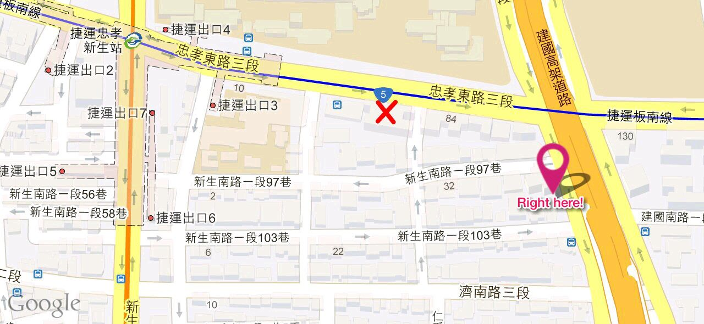

# Whoscoming2dinner 場次2

[上一場](whoscoming2dinner-01) || [活動主頁](whoscoming2dinner) || 下一場

## 誰來晚餐

[活動介紹](https://www.hackingthursday.org/whoscoming2dinner)
--]

## 活動資訊



|      |                                                                      |
| ---- | -------------------------------------------------------------------- |
| 主題 | 隨心所欲送 patch                                                     |
| 講者 | 陳侃如 (Kanru)                                                       |
| 日期 | 2015-11-05 (四) 20:00~21:00 ( 19:00 入場, 會後自由交流時間至 22:00 ) |
| 地點 | 伯朗咖啡建國店, 台北市建國南路一段 166 號 3 樓                       |
| 人數 | 25                                                                   |

- 報名截止日: 活動當日中午 or 已達場次人數上限
- **場地注意事項**
    - 每人最低消費金額爲 $160，並需交回發票統計

## 內容簡介


參與 FLOSS Project，向 upstream 送上 patch 才是貢獻？    ;-)

講者長久以來參與各種 Project，無論是興趣還是工作需要，送過各種大大小小的 patch，
希望和各位分享從中得到的一些經驗，讓大家一起輕鬆送 patch！

講者目前任職於引領 Firefox 瀏覽器開發的 Mozilla 公司，開發 Firefox OS 作業系統，
同時也是 Debian 義工，維護幾個常用的軟體套件，既是 upstream 也是 contributor，
悠遊於 FLOSS 社群。

<https://kanru.info/>

## 演講筆記

$4:

```
$ git format-patch --cover-letter
```

yan: LGTM

kanru: SGTM

kanru: TY (thank you)

## 會後整理

- 影片 <https://www.youtube.com/watch?v=03Hyq_asnn8>
- 活動其他筆記 <https://www.hackingthursday.org/2015-11-05>

## 會後問卷

<https://goo.gl/DMSiSY>

## 報名 & 簽到

(以下開放自行編輯新增)
- yan
- htchien
- Mat
- $4
- YChao
- ...
